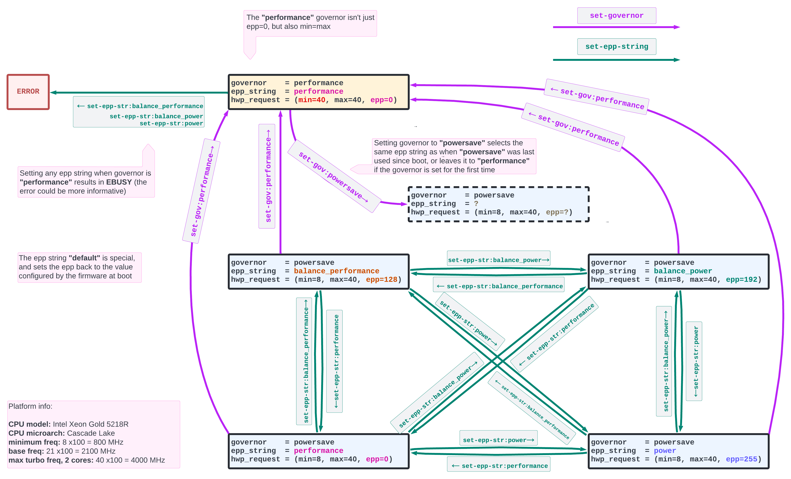
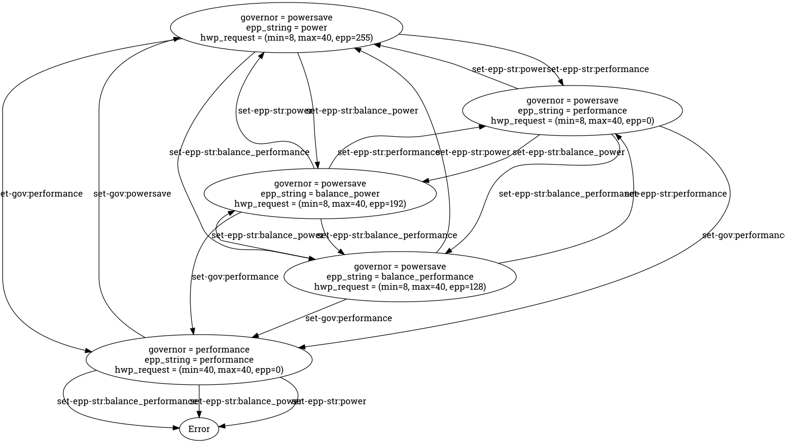

# Intel PState States



Since Skylake, Intel processors have a power control unit (PCU) in the SoC that
takes care of frequency scaling. This feature is called HWP (Hardware-managed
P-States) or Intel Speed Shift. The operating system can configure the behavior
of HWP using five paramters:

* minimum frequency: the CPU shouldn't run below this clock frequency
* maximum frequency: the CPU shouldn't run above this clock frequency
* desired frequency: the CPU should run at this clock frequency
* energy-performance preference: a value in 0-255 indicating if performance
or energy efficiency should be favored
* activity window: size of the time window to consider for predicting future
activity

The OS sets these parameters via MSR 0x774, called MSR_HWP_REQUEST.

Linux, however, exposes two user interfaces to userspace to interact with HWP.
These are the selection of the "scaling governor", which is done writing either
"performance" or "powersave" in the sysfs file

```
/sys/devices/system/cpu/cpufreq/policy<X>/scaling_governor
```

where `X` is the CPU number, and the selection of the "Energy-Peformance Preference"
by writing either a mnemonic string or a numeric value in the sysfs file

```
/sys/devices/system/cpu/cpufreq/policy<X>/energy_performance_preference
```

While the five HWP parameters can be set via MSR_HWP_REQUEST independently of
each other, the sysfs interfaces above impose a few sanity constraints and enforce
policy to some extent.

The script `intel-pstates-state.py` is meant to find out what those constraints
are, in a "black-box" fashion. It starts from the current state of the systems,
and explores the space of possible configurations in a breadth-first manner, by
setting the above sysfs files to all possible values. After applying a certain
setting via sysfs (a change of governor, or a change of EPP), it goes back to
the previous state by mean of direct writes to MSR_HWP_REQUEST and tries a different
setting.

This exploration strategy treats the HWP configuration via sysfs as a state machine,
and assumes there's no memory when transitioning from a state to the next.
As it turns out, this assumption is incorrect: when changing the governor from
"performance" to "powersave", the EPP is set to the value it had when "powersave"
was last used since boot. With this respect, the state diagram is incomplete.

The script requires to be run as root, as it writes to sysfs files and the MSR 0x774.

Here a sample output:
```
# ./intel-pstate-states.py
STATE: IntelPStateState(governor='powersave', epp_string='balance_performance', hwpreq=HWPRequest(min=8, max=40, des=0, epp=128, window=0, pkg=0))
ACTION: set-gov:performance
NEW STATE: IntelPStateState(governor='performance', epp_string='performance', hwpreq=HWPRequest(min=40, max=40, des=0, epp=0, window=0, pkg=0))

STATE: IntelPStateState(governor='powersave', epp_string='balance_performance', hwpreq=HWPRequest(min=8, max=40, des=0, epp=128, window=0, pkg=0))
ACTION: set-epp-str:performance
NEW STATE: IntelPStateState(governor='powersave', epp_string='performance', hwpreq=HWPRequest(min=8, max=40, des=0, epp=0, window=0, pkg=0))

STATE: IntelPStateState(governor='powersave', epp_string='balance_performance', hwpreq=HWPRequest(min=8, max=40, des=0, epp=128, window=0, pkg=0))
ACTION: set-epp-str:balance_power
NEW STATE: IntelPStateState(governor='powersave', epp_string='balance_power', hwpreq=HWPRequest(min=8, max=40, des=0, epp=192, window=0, pkg=0))
[...]

Written intel-pstate-states.dot
```

The resulting graph, rendered with graphviz, is similar to the following.
A cleaned up and annotated version of it is at the beginning of this document.
